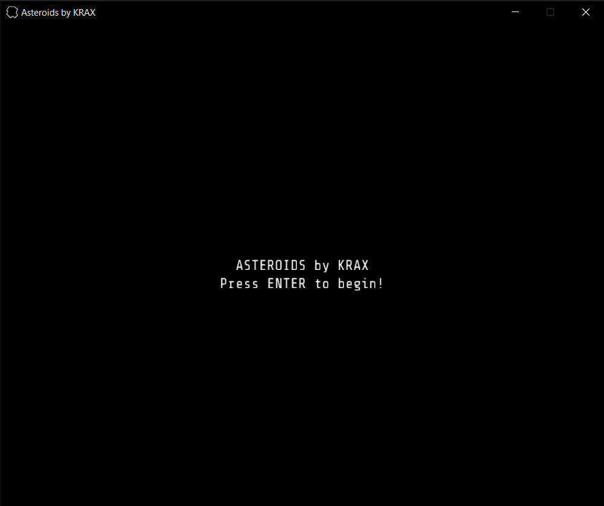
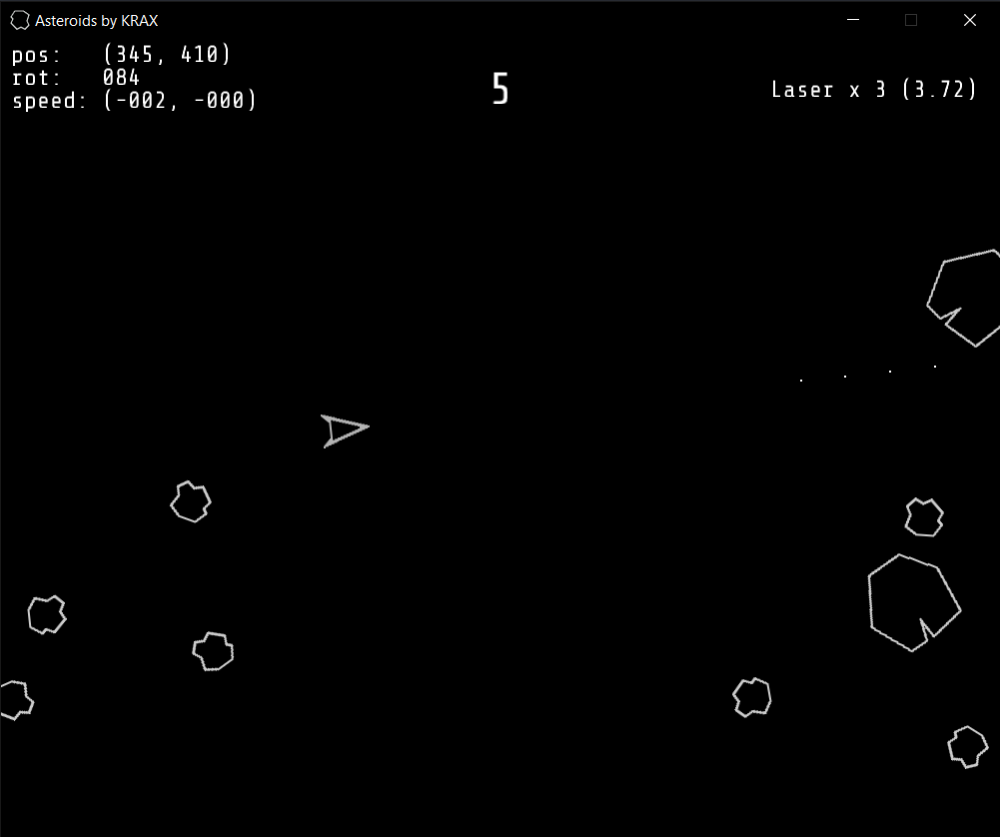
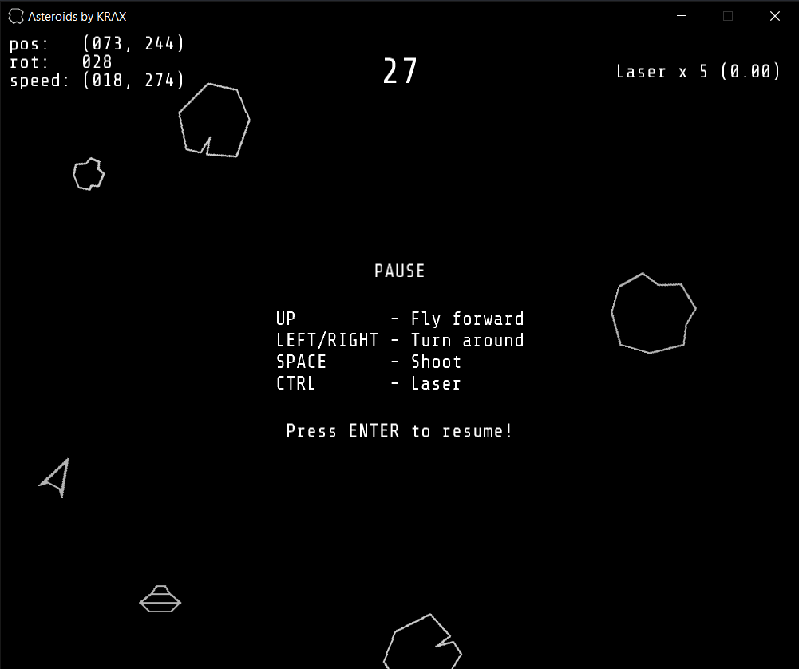
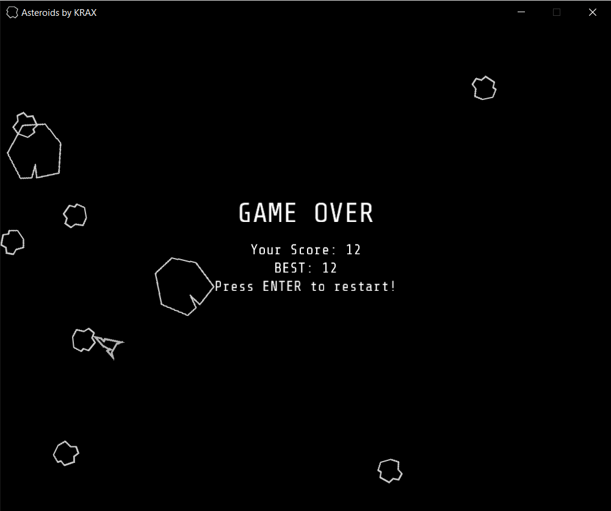
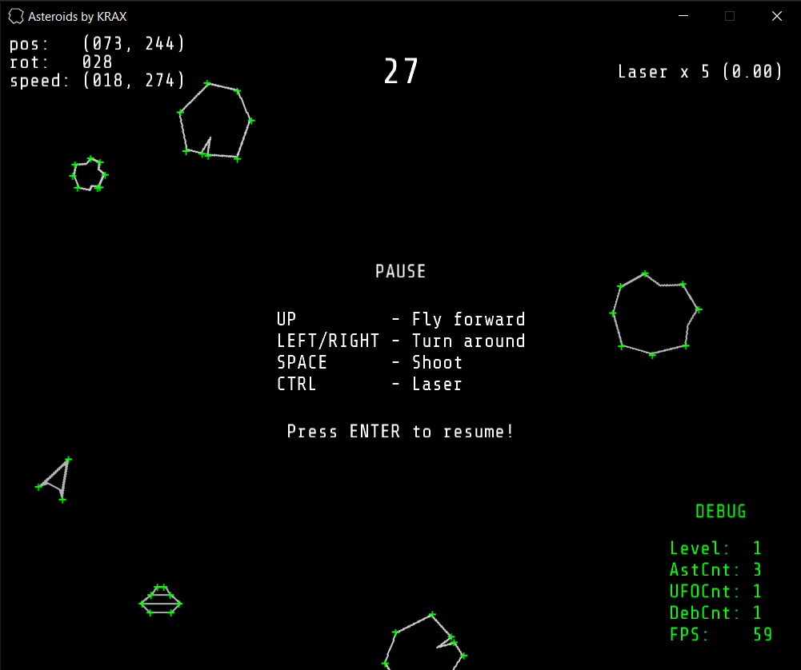

# Asteroids by KRAX 
*1979 [Asteroids][1] game by "Atari, inc." replica.*

[1]: https://en.wikipedia.org/wiki/Asteroids_(video_game) 

---
### Download

[Ready build v1](https://github.com/mr-KRAX/Asteroids/blob/master/Builds/Asteroids%20by%20KRAX.exe)  

### Objective

Destroy Asteroids and UFOs and avoid colliding with them

### Gameplay

Thrust and turn your ship to move it. Use regular bullets and lasers to kill floating enemies. The number of laser shots is limited and it takes 5s to recharge one. Every killed enemy gives you one point. Big asteroids breake into smaller debries that have greater speed.

---

### Screenshots
Start Menu

Gameplay

Pause Menu

Game Over

Debug mode

